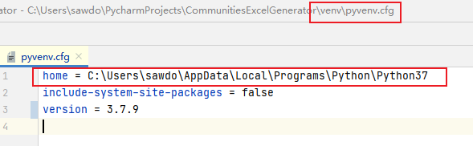
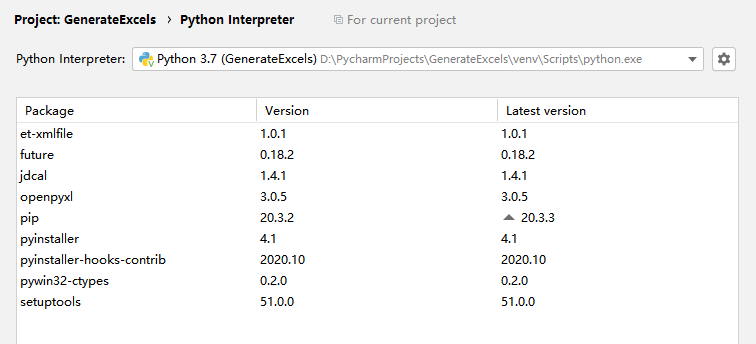

# 社区Excel文件生成器
## 主要功能
* 根据模板.xlsx 一键生成多个Excel文件。

## 环境配置
* PyCharm 2020.3 (Community Edition) Build #PC-203.5981.165, built on December 2, 2020
    
* 需要把venv目录下的pyvenv.cfg文件里的path修改为您的python的安装路径

  
* Python 包依赖，可在Pycharm中打开requirements.txt，点击右上角的install按钮自动安装


  
## 打包方法
* windows系统直接运行根目录下的package.bat即可
* 其他类Unix系统请手动在终端内执行命令 `venv/Scripts/pyinstaller.exe --onefile main.spec`

## License
```
MIT License

Copyright (c) 2020 SawXu

Permission is hereby granted, free of charge, to any person obtaining a copy
of this software and associated documentation files (the "Software"), to deal
in the Software without restriction, including without limitation the rights
to use, copy, modify, merge, publish, distribute, sublicense, and/or sell
copies of the Software, and to permit persons to whom the Software is
furnished to do so, subject to the following conditions:

The above copyright notice and this permission notice shall be included in all
copies or substantial portions of the Software.

THE SOFTWARE IS PROVIDED "AS IS", WITHOUT WARRANTY OF ANY KIND, EXPRESS OR
IMPLIED, INCLUDING BUT NOT LIMITED TO THE WARRANTIES OF MERCHANTABILITY,
FITNESS FOR A PARTICULAR PURPOSE AND NONINFRINGEMENT. IN NO EVENT SHALL THE
AUTHORS OR COPYRIGHT HOLDERS BE LIABLE FOR ANY CLAIM, DAMAGES OR OTHER
LIABILITY, WHETHER IN AN ACTION OF CONTRACT, TORT OR OTHERWISE, ARISING FROM,
OUT OF OR IN CONNECTION WITH THE SOFTWARE OR THE USE OR OTHER DEALINGS IN THE
SOFTWARE.
```